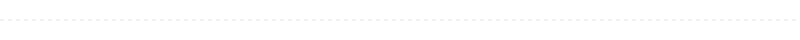
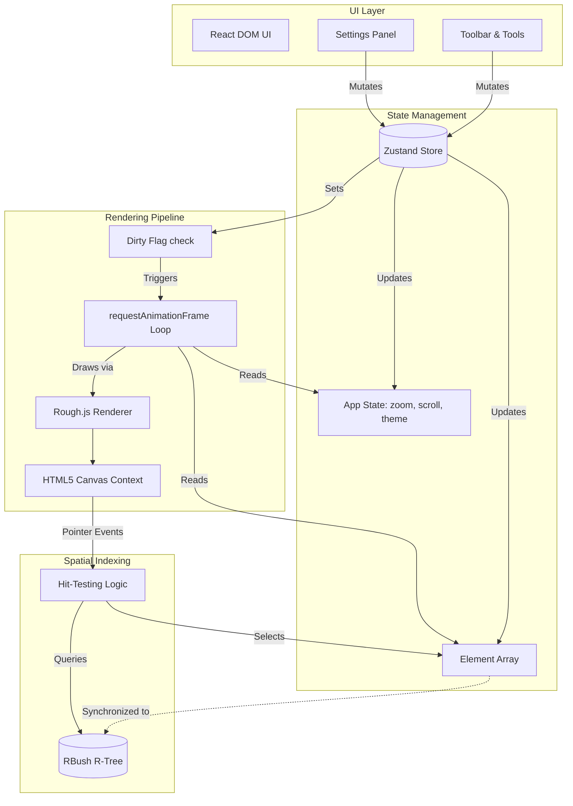

# Architecture & Technical Design

<picture>
  <source media="(prefers-color-scheme: dark)" srcset="./assets/divider-dark.svg">
  <source media="(prefers-color-scheme: light)" srcset="./assets/divider-light.svg">
  
</picture>

Xcalidraw is a React-based application that heavily utilizes the HTML5 `<canvas>` element for rendering. Unlike traditional React applications where UI state directly maps to DOM elements, Xcalidraw manages its own render pipeline outside of the React lifecycle to achieve 60 FPS performance on complex scenes.

## High-Level System Diagram

<picture>
  <source media="(prefers-color-scheme: dark)" srcset="./assets/divider-dark.svg">
  <source media="(prefers-color-scheme: light)" srcset="./assets/divider-light.svg">
  
</picture>

## Core Systems Overview

### 1. Render Pipeline & Dirty Flag
Xcalidraw does not rely on React to re-render the canvas. Instead, it utilizes a custom `requestAnimationFrame` (RAF) loop attached directly to the canvas ref. To prevent wasting CPU cycles, rendering is gated behind a global `dirty` flag. When the Zustand store updates, it flips `dirty = true`. The RAF loop checks this flag every frame; if true, it clears the canvas, redraws all elements, and sets the flag back to false.

### 2. Spatial Indexing (RBush)
As the number of elements on the canvas grows, looping through every element to determine if a pointer clicked on it becomes an $O(N)$ bottleneck. Xcalidraw solves this by maintaining an [RBush](https://github.com/mourner/rbush) R-tree. Elements are inserted into the tree using their bounding boxes. When a user clicks, the system queries the R-tree for elements intersecting a small 10x10 area around the pointer, turning an $O(N)$ lookup into $O(\log N)$.

### 3. State Management
All source-of-truth data lives in a global [Zustand](https://github.com/pmndrs/zustand) store. This store is split conceptually into two parts:
- `elements`: An array of all shapes drawn on the canvas.
- `appState`: Global metadata like current zoom, scroll offsets, active tool, and UI panel visibility.

React components (like the Toolbar) subscribe to this store to update their UI, while the Canvas render loop reads from the store directly during its RAF cycle without triggering React renders.

### 4. Coordinate Systems
The application maintains two distinct coordinate systems:
1. **Screen Coordinates:** The absolute pixel values on your monitor (e.g., where the mouse event fired).
2. **World Coordinates:** The infinite conceptual canvas space.

Helper functions (`screenToWorld` and `worldToScreen`) apply the current `appState.zoom` and `appState.scroll` values to seamlessly translate between these spaces during interactions.

> **Deep Dive:** For full implementation details and code snippets, see the `/docs/architecture` section in the live application.

<picture>
  <source media="(prefers-color-scheme: dark)" srcset="./assets/divider-dark.svg">
  <source media="(prefers-color-scheme: light)" srcset="./assets/divider-light.svg">
  
</picture>

## Why These Technical Choices?

* **Why Rough.js?** 
  Standard canvas primitives (lines, rects) look sterile and mechanical. `Rough.js` is utilized to compute sketchy, hand-drawn vector paths. It fits the core design aesthetic of an unopinionated ideation whiteboard perfectly, making diagrams look organic.
  
* **Why RBush?**
  Canvas elements are inherently unaware of pointer events—the browser only knows you clicked the `<canvas>` DOM node. Implementing a high-performance selection model requires spatial awareness. RBush is a mature, zero-dependency R-tree implementation that provides exactly the fast 2D spatial indexing needed for hit-testing without bloating the bundle.

* **Why the Dirty-Flag / RAF Loop?**
  React's declarative model is excellent for building the UI toolbars, but terrible for 60 FPS continuous rendering of thousands of geometric shapes. By decoupling the canvas draw loop from React's state reconciliation and gating it behind a `dirty` flag, Xcalidraw guarantees that React renders only update the HTML toolbars, while the canvas only redraws precisely when data actually changes.
